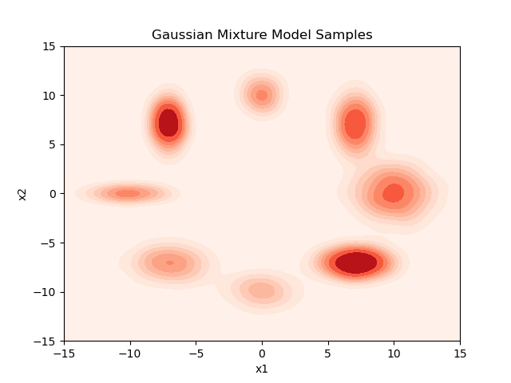
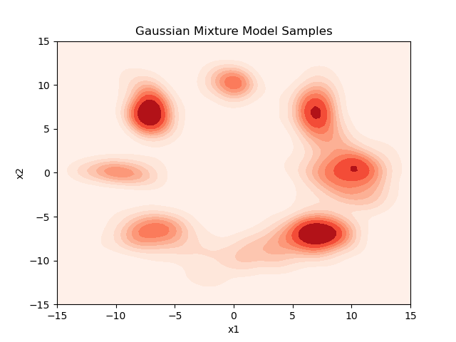
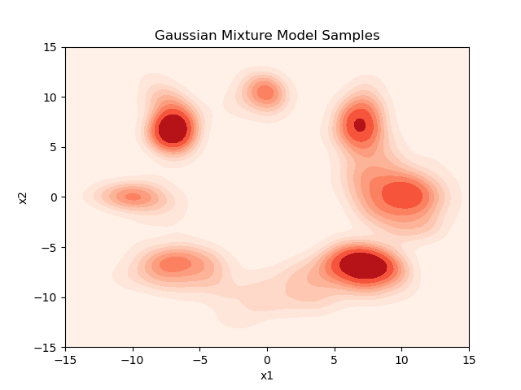
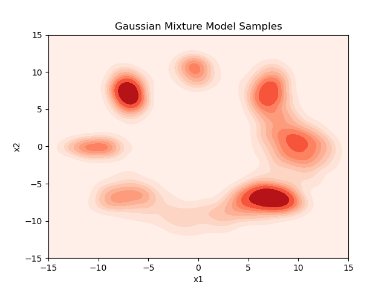

# Writeup

## Metric
The goal of this assessment is to understand various generative models. The first question we need to address is how we can compare the samples generated by two methods. We defined a metric based on KL-divergence. Why is loss not enough? If the training samples are fewer, the loss will be smaller, but even the validation loss is not right to compare. Let's give you a simple example. Compare the loss of Score and diffusion models. $L_{DDPM} = L_{Score} -C_1 + C_2$. where $C_1$
and $C_2$ are constants. 

We cannot use FD (Frechet Distance), which is a common metric for images, as it assumes normality of the data points, which is violated for GMMs.

### KL Measure 
$$p_{estimate}(x) = \frac{1}{hN}\Sigma_i^N  K(\frac{x - x_i}{h})n$$
$$q_{true}(x) = \Sigma \alpha_i \mathcal{N}(\mu_i, \sigma_i)$$
$$KLD = KL(q||p)$$
Where \(K\) is any kernel, here we assume a Gaussian kernel for simplicity. The idea is that we are estimating the probability or density of the generated samples by a Gaussian kernel and comparing the actual density of \(x\) given by \(q\), which is a mixture of Gaussians. Smaller it is, better the generation quality.

Why are the generative model papers not using this metric? Here we are making a huge assumption of estimating likelihood by kernel density. This holds true only for a large sample size. For our example, as it is toy data, this suits the purpose and we have a large sample size.

## Score based models & DDPM

In this problem we are solving an SDE of the form
$$dx_t = f(x,t)dt + g(t)dw$$
$$dx_t = [f(x,t) - g^2(t)\nabla_{x_t}\log p_t(x_t)]dt + g(t)d\bar{w}$$

We can have any function $f$ and $g$ and solve the SDE in the forward and then sample in the reverse direction.

Generally, we don't have the closed form for $\nabla_{x_t}\log p_t(x_t)$. In this example, we have it because we know the distribution of $x_0$, which is a mixture of Gaussian, and also $x_t = x_0 * \mathcal{N}(\mu,\sigma)$. However, we will assume the general case in which the distribution of $x_0$ is unknown; for such cases, $\nabla_{x_t}\log p_t(x_t)$ is not tractable.

One advantage we have is $p(x_t|x_0)$ is tractable.
$$\log p(x_t) = \log \mathop{\mathbb{E}}_{x_0} p(x_t|x_0)*p(x_0)$$
$$\log p(x_t) \ge \mathop{\mathbb{E}}_{x_0} [\log p(x_t|x_0)*p(x_0)]$$
$$\nabla_{x_t} \log p(x_t) \ge  \nabla_{x_t} \mathop{\mathbb{E}}_{x_0} [\log p(x_t|x_0)+ \log p(x_0)]$$
$$\nabla_{x_t} \log p(x_t) \ge\mathop{\mathbb{E}}_{x_0} [  \nabla_{x_t} \log p(x_t|x_0)]$$

Based on ELBO property we can replace the probabilty with the conditional probability and an expectation.

We can derive the same thing as derived in the score based or energy based models, levaraging for small $\sigma$, $E_{q\sigma}(f(\tilde{x}) - \nabla\log({q_\sigma{\tilde{x}}}) ) = E_{p}(f(x) - \nabla\log({p(x)}) )$ and from here we can show that the E can be relplaced with conditionals by re arranging terms.

What is the performance without learning as we have true distributions $p(x_t)$, we can have a score in closed form, and we can generate samples from these distributions. This will serve as a benchmark to aim at.

| Sampling   |    KL Measure |
|----------|:-------------:|
| p(x) |  25.13 |

This is not perfect 0 because of the approximation of loss by Gaussian kernel density. If the number of samples tends to infinity, this will be 0. Also, one other reason is due to the Langevin dynamics assumptions, $dt$ should be very small as well as $T$ should be large.

Now we know the closed form of the conditional in the forward pass and in the reverse direction we replace $\nabla_{x_t}\log p_t(x_t)$ with $s_{\theta}(x,t)$.

During training, we train with a score matching loss
$$L = \mathop{\mathbb{E}}_{x_0}\mathop{\mathbb{E}}_{t \sim U[0,T]} [\lambda(t)||s_{\theta}(x,t) -\nabla_{x_t}\log p_t(x_t)||_2^2 ]$$

Where can improvements come from? 

There are three important parameters in the score-based models where improvements can come:

1. Choice of SDE
2. Choice of $\lambda(t)$
3. Choice of model for $s_{\theta}(x,t)$

### Choice of SDE

In the paper DDPM, Ho et al. have shown that score models and denoising diffusion models are the same but with a different form for SDE. 

In this, we will only write the SDE and the forward process; the backward for the following is available in the code.

In the FwdOrnstein-Uhlenbeck Process, the forward SDE is given by 
$$f(x_t,t) = -x_t, g(t) = \sqrt{2}$$
$$x_t = e^{-t}x_0 + \sqrt{1- e^{-2t}} \epsilon$$

It can be shown that DDPM is shown as 

$$f(x_t,t) = \frac{-\beta_t}{2}, g(t) = \sqrt{\beta_t}$$

$$x_t =  \sqrt{1- \alpha_t}x_0 + \sqrt{\alpha_t} \epsilon$$

We can try multiple different $f(x_t,t),g(t)$ However, I do not have a background in solving SDE. So  Here we show that using DDPM will improve the KLD metric.

### Choice of Weigting Loss function

The derivation of the score will have a uniform weight to the score matching across all time steps. However, Ho et al. found that assigning a higher weight to larger variance scores will improve the model performance. Indeed, we also observe similar performance.

Ho et al. recommends
$$\lambda(t) \propto \frac{1}{\mathop{\mathbb{E}}_{x_0}(||-\nabla_{x_t}\log p_t(x_t|x_0)||_2^2)}$$

We will derive this for both DDPM and OU process.

For DDPM:
$$\mathop{\mathbb{E}}_{x_0}(-\nabla_{x_t}\log p_t(x_t|x_0)) = \frac{\sqrt{1- \alpha_t} x_0 - x_t}{\sigma_i^2}$$
$$\mathop{\mathbb{E}}_{x_0}(-\nabla_{x_t}\log p_t(x_t|x_0)) = ||\frac{\sqrt{1- \alpha_t}x_0 - x_t}{(1- \alpha_t)}||_2^2$$
$$\mathop{\mathbb{E}}_{x_0}(-\nabla_{x_t}\log p_t(x_t|x_0)) = ||\frac{\epsilon}{\sqrt{1- \alpha_t}}||_2^2$$
$$\lambda(t) = \frac{1- \alpha_t}{2}$$

For the OU process, it is very similar; $\lambda(t)$ is nothing more than the variance schedule.

The variance schedule of the OU process is 

$$\lambda(t) = \frac{1 - e^{-2t}}{2}$$

### choice of model

We can vary the size of the models and also bring changes to the architecture. We did not find much gain by improving the depth of the model as well as adding batch norm or residual connections. One of the ablation studies we can perform is to change the architectures from MLP to transformers and embedding time as sinusoidal positional embeddings. However, we have observed that this setup did not yield much improvement.

Transformers are not ideal for this dataset as there is no contextual dependency. However, we hypothesize that Hypernetworks are a better choice for this task. Due to time constraints, we could not perform experiments on them.

## Results 

  <table>
    <tr>
      <th>Diffusion process</th>
      <th>Score weight</th>
      <th> KL Measure </th>
    </tr>
    <tr>
      <td>FwdOrnstein-Uhlenbeck</td>
      <td>Uniform</td>
      <td>33.61</td>
    </tr>
    <tr>
      <td>FwdOrnstein-Uhlenbeck</td>
      <td>Inv Variance Schedule</td>
      <td>32.24</td>
    </tr>
    <tr>
      <td>DDPM</td>
      <td>Uniform</td>
      <td><b>28.04</\b></td>
    </tr>
    <tr>
      <td>DDPM</td>
      <td>Inv Variance Schedule</td>
      <td>28.62</td>
    </tr>
  </table>

The final distribution plot across different settings along with ground truth.
<table style="border-collapse: collapse;">
    <tr>
        <td colspan="2" style="border: 1px solid black; padding: 10px; text-align: center;"> Ground truth distribution</td>
    </tr>
    <tr>
        <td style="border: 1px solid black; padding: 10px; text-align: center;"> FwdOrnstein-Uhlenbeck Uniform</td>
        <td style="border: 1px solid black; padding: 10px; text-align: center;"> FwdOrnstein-Uhlenbeck Inv variance weight</td>
    </tr>
    <tr>
        <td style="border: 1px solid black; padding: 10px; text-align: center;"> DDPM uniform</td>
        <td style="border: 1px solid black; padding: 10px; text-align: center;"> DDPM Inv variance weight</td>
    </tr>
</table>

## VAE & Hierachial VAE & Learned variance DDPM

We start with VAE. However, we know the nature of the data, so we consider everything in our favor. We will make the latent sample from 8 categorical latent, representing 8 modes of GMM.

We will derive closed-form for 8 categorical latent using Gumbel softmax reparametrization trick.

VAE does importance sampling, where the encoder will encode the sample to the latent distribution. Will all the samples from a mode map to a category in the latent space? The answer is no. This implies that VAE does not learn the causal underpinnings.

### How to run the experiments

`python score.py`

### Future work

1. Implement Hypernetworks conditioned on sinusoidal time embeddings.
2. Work on conditional generation of modes.
3. Show that Hierarchical VAE is nothing but a diffusion model with learning \(f(x,t)\) and \(g(t)\) in the stochastic diffusion equation.

### References
1. Chan, S. H. (2024). Tutorial on Diffusion Models for Imaging and Vision. arXiv preprint arXiv:2403.18103. https://arxiv.org/pdf/2403.18103.pdf.
2. Weng, Lilian. (Jul 2021). What are diffusion models? Lil’Log. https://lilianweng.github.io/posts/2021-07-11-diffusion-models/.
3. Vishnu Boddeti. (2024). Deep Learning. https://hal.cse.msu.edu/teaching/2024-spring-deep-learning/
4. Arash Vahdat. et al. (2022). CVPR. https://cvpr2022-tutorial-diffusion-models.github.io/